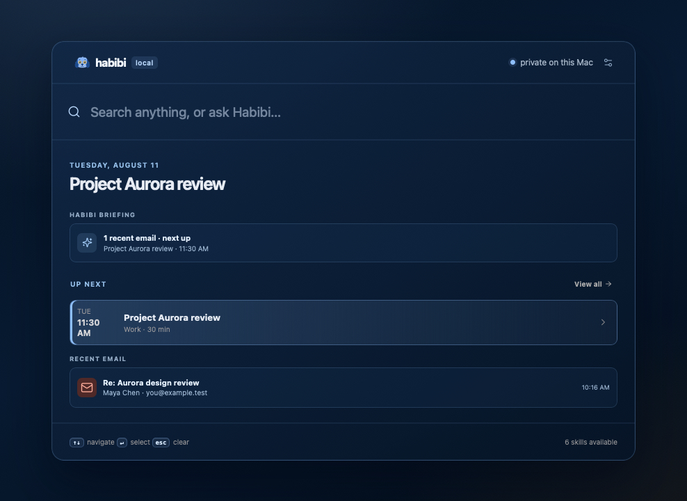
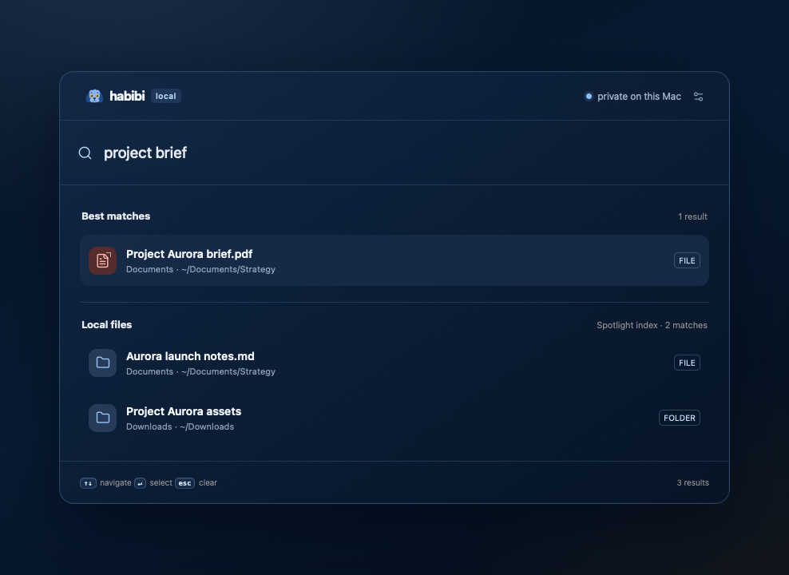
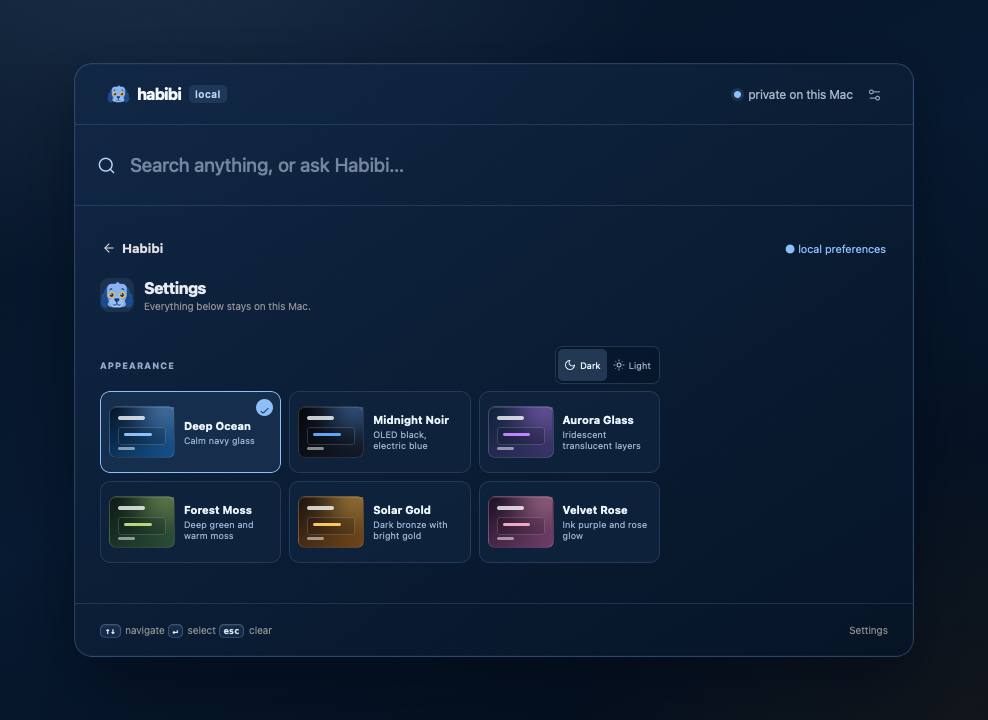

<p align="center">
  
</p>

<h1 align="center">Habibi</h1>

<p align="center">
  <strong>A private, local-first command center for macOS.</strong><br />
  Search, act, and ask—without turning your desktop into a browser tab.
</p>

<p align="center">
  <kbd>⌥ Space</kbd>&nbsp; Search anything &nbsp;·&nbsp; Ask Habibi &nbsp;·&nbsp; Open a capability
</p>

<p align="center">
  An open-source project by <a href="https://github.com/clidey">Clidey, Inc.</a>
</p>

Habibi is a fast keyboard launcher for the things that normally require opening
five apps: finding a file, reading a mail thread, checking your calendar,
messaging someone, opening an agent session, or asking a model to help. It runs
as a native macOS app with a local service—not a cloud dashboard.

**One rule governs every integration:** nothing external is sent, created, or
changed without a clear user action and fresh approval.

## See it in action

Habibi opens into a useful, quiet briefing—not an empty search box. From there,
you can move entirely with the keyboard into local search, connected apps, or
private chat.

<p align="center">
  
</p>

| Local search | Yours to shape |
| --- | --- |
|  |  |
| **Fast, relevant results.** Apps, folders, and files are ranked for the intent—not dumped from an index. | **Personal on purpose.** Choose a theme, launcher shortcut, and how much context appears on Home. |

> Every screenshot is Habibi’s real UI in a sealed fictional-data demo mode.
> Generate them locally with `pnpm generate:demo-screenshots`; no account,
> connector, file, or desktop data is captured for this repository.

## Why it feels different

- **Fast on the obvious path.** Search uses macOS Spotlight metadata, local
  ranking, and intent-aware app/folder matching. Documents, Desktop, Downloads,
  and project folders come first when they should.
- **Private by default.** The service binds only to `127.0.0.1`; connector
  credentials and sessions stay on your Mac.
- **Agent-native, not agent-only.** Use Ollama or LM Studio locally, or bring
  your own OpenAI, Anthropic, or Gemini key. Direct answers stay direct; a
  model is there when it is useful, not as the launcher itself.
- **Permissionful by design.** Reads are scoped. Sends, calendar writes,
  and system actions require a fresh, single-use approval.
- **Keyboard-first everywhere.** Arrow keys, Enter, Escape, focus management,
  and shortcut recording are shared across every surface.
- **Built to extend.** Integrations are permission-scoped skills with typed
  contracts, runtime validation, and a consistent launcher/search contract.

## One launcher, many local surfaces

| Search or type | Habibi opens |
| --- | --- |
| `passport`, `Downloads`, `deck pdf` | Relevant local files and folders, with Quick Look, reveal, and drag-out support. |
| `WhatsApp`, `message Sam`, `ping the team` | Local chats, recents, history, and a draft before any send. |
| `mail`, `invoice from Maya` | Connected IMAP inboxes, safe thread rendering, reply drafts, and provider deep links. |
| `next Friday 2–3 meeting Raj` | A calendar draft to review before creation. |
| `find a hotel in St Ives next weekend` | A refined browser search when there is enough context to search well. |
| `what is FOC?` | A direct private answer from the configured model—no unnecessary browser search. |
| `Kubernetes`, `Codex`, `Claude` | Read-only cluster inspection and local agent-session discovery. |

## What it can do today

| Capability | Experience | Safety model |
| --- | --- | --- |
| Files | Search local files, Quick Look, open/reveal, drag into a draft | Metadata stays local |
| Calendar | See upcoming events and prepare create/update drafts | Explicit approval before writes |
| WhatsApp ([setup](#connect-whatsapp)) | Local OpenWA connection, recents, chat history, drafts | Explicit approval before sends; experimental |
| Mail | Gmail and Zoho IMAP inboxes, search, threads, open in provider | Credentials stay on your Mac |
| Browser | Intent-aware Google, Airbnb, ChatGPT, Claude, and Gemini opening | Only reviewed allow-listed URLs open |
| Habibi chat | Ephemeral conversation, attachments, pasted screenshots/text | Configurable local or bring-your-own model |
| Agent Dock | Discover and open local Codex / Claude Code sessions | User-initiated terminal launch |

## Quick start

Habibi is a native macOS app, not a website: the launcher spawns a local shell,
drives Calendar and Automation, and runs an embedded terminal, none of which a
browser tab can do. There is no supported browser mode — build and run the app.

### Requirements

- macOS 13 or later
- [pnpm](https://pnpm.io/installation)
- Node.js 22+ (`.nvmrc` pins the exact version CI builds against)
- Xcode Command Line Tools (`xcode-select --install`), for `swiftc`

### Build and run

```sh
pnpm install
native/build-app.sh
open build/Habibi.app
```

`native/build-app.sh` bundles WhatsApp's gateway ([OpenWA](https://github.com/rmyndharis/OpenWA),
fetched fresh at build time — nothing WhatsApp-related is checked into this
repo) and a real Chromium into the app; since Chromium has no universal build,
this needs `HABIBI_OPENWA_ARCH=arm64` or `=x64` set to say which Chromium to
download (the script exits with an error naming this if it's unset). For a
faster local build without WhatsApp, skip that step entirely with
`HABIBI_SKIP_OPENWA=1 native/build-app.sh`. Pinned versions for OpenWA,
Chromium, and Node live in `native/versions.sh` — bump them there.

The native app owns the global launcher shortcut (default: <kbd>⌥ Space</kbd>),
native pasteboard support, window placement, and a floating WebKit panel.
`build/Habibi.app` is a local build artifact and is intentionally ignored by
Git.

The build is unsigned, so the first launch needs one confirmation: right-click
`Habibi.app` → **Open** → **Open** in the Gatekeeper dialog. (Signed, notarized
releases don't need this step.)

Because the build is unsigned, its identity changes on every rebuild, so macOS
treats each build as a new app and discards previously granted permissions.
The launcher requests Calendar and Automation access the first time each is
used — if either was denied on an earlier build, reset it before rebuilding:

```sh
tccutil reset Calendar com.clidey.habibi
tccutil reset AppleEvents com.clidey.habibi
```

If <kbd>⌥ Space</kbd> does nothing, another app (Alfred and Raycast both
default to it) has likely already claimed the shortcut. macOS reports the
registration as successful either way, so there's no error to see. Open Habibi
from its menu bar icon instead, then record a different shortcut in Settings.

## Configure a model

The first time you open **Ask Habibi**, choose one of:

- **Ollama** — local models on `127.0.0.1:11434`
- **LM Studio** — OpenAI-compatible local server
- **OpenAI, Anthropic, or Gemini** — your own API key, saved in macOS Keychain

Habibi never automatically sends your contacts, mail, calendar, messages, or
files to a model. Attachments and context are only passed when you deliberately
submit them.

## Connect WhatsApp

WhatsApp is an optional local component in the packaged app. The first time you
open **WhatsApp**, Habibi downloads the matching Apple Silicon or Intel runtime,
asks macOS to verify its Developer ID signature and notarization, and installs
it under Application Support. Releases provide separate Apple Silicon and
Intel DMGs so the main app carries only the Node runtime it can execute. The
component contains
[OpenWA](https://github.com/rmyndharis/OpenWA) (MIT-licensed) and its private
Chromium runtime. Scan the QR code once; the session persists across restarts.

This is WhatsApp Web automation, not the official WhatsApp Business API — using
it carries a risk of account restriction, so treat it as experimental and don't
rely on it for anything time-sensitive.

If you're running only the Node service from source with `pnpm start`, run
OpenWA yourself:

```sh
git clone https://github.com/rmyndharis/OpenWA.git
cd OpenWA
npm ci
BOOTSTRAP_KEY_FILE=/path/to/habibi/.openwa/data/.api-key npm run dev
```

(or run OpenWA's own `docker-compose.dev.yml` with the same `BOOTSTRAP_KEY_FILE`
override.) Habibi reads the generated API key from `.openwa/data/.api-key`
inside its own workspace; OpenWA creates that file itself on first run.

## Agent workflows

Habibi can discover local Codex and Claude Code sessions today. We are still
working out the best UX for bringing existing agent workflows—such as Codex
skills, Claude commands, and MCP tools—into the launcher. The goal is to make
them useful and understandable in context, rather than turn Habibi into a
generic agent dashboard.

## Architecture

```text
┌───────────────────────────────────────────────────────────────┐
│                     Habibi.app (Swift/AppKit)                  │
│  global shortcut · native pasteboard · window/panel lifecycle  │
└───────────────────────────────┬───────────────────────────────┘
                                │ local WebKit
┌───────────────────────────────▼───────────────────────────────┐
│                   Node service · 127.0.0.1 only                │
│  local HTTP API · approval tokens · Host/Origin protection     │
└───────────────┬───────────────────────┬───────────────────────┘
                │                       │
     ┌──────────▼──────────┐  ┌─────────▼──────────────────────┐
     │ Typed skill runtime │  │ Local connectors and services  │
     │ manifests · policy  │  │ Mail · Calendar · OpenWA · MCP │
     └─────────────────────┘  └────────────────────────────────┘
```

- `native/` — Swift/AppKit host and macOS adapters.
- `src/contracts/` — strict public TypeScript contracts.
- `src/core/` — skill validation, approval tokens, local HTTP security.
- `src/connectors/` — provider-specific transports.
- `src/server/services/` — normalized local domain behavior.
- `src/agent/` — Pi agent harness, MCP bridge, imported-skill workflow.
- `src/client/` — keyboard-first browser UI modules.
- `skills/` — declarative, permission-scoped built-in capabilities.

Read [ARCHITECTURE.md](ARCHITECTURE.md) for the full boundary and approval
model.

## Add a skill

Every integration is a small, bounded capability—not a UI rewrite.

1. Add `skills/<id>/manifest.json` using the typed
   [`SkillManifest`](src/contracts/skill.ts) contract.
2. Add one provider transport under `src/connectors/`.
3. Put normalized behavior in `src/server/services/`.
4. Expose read/search/preview operations separately from confirmed execution.
5. Add a focused regression test.

Skill manifests are validated at runtime and in CI. Declaring a permission does
not grant it automatically; the host remains responsible for approval and
side-effect policy.

### K9s: read-only Kubernetes inspection

[`plugins/k9s`](plugins/k9s) is a small K9s plugin bundle that demonstrates a
useful, constrained external integration: selected-resource descriptions and
YAML, the latest 200 pod log lines, and namespace events. It never invokes a
write-capable `kubectl` verb. Each invocation appends only action metadata,
context, namespace, timestamp, and exit status to
`$XDG_STATE_HOME/habibi/k9s-readonly/audit.jsonl`; resource data and log output
are never recorded.

```sh
plugins/k9s/install.sh
```

Restart K9s, ensure `~/.local/bin` is on its `PATH`, then use
<kbd>Shift-D</kbd> to describe the selected resource, <kbd>Shift-Y</kbd> for
YAML, <kbd>Shift-L</kbd> for recent pod logs, or <kbd>Shift-E</kbd> for events.
K9s loads plugins from its XDG configuration/data directories and supplies the
selected resource, namespace, container, and context as plugin variables; see
the [K9s plugin documentation](https://k9scli.io/topics/plugins/) for the
underlying format.

## Development

```sh
pnpm run check
```

This runs:

- strict TypeScript checks for public contracts;
- a check that every source and client reference resolves, since a missing
  import fails silently at runtime rather than at build time;
- manifest validation;
- the regression suite.

See [CONTRIBUTING.md](CONTRIBUTING.md) before opening a pull request.

## Security and privacy

Habibi is a single-user desktop companion, not a network service. Its local
server rejects non-local Host/Origin values, and secrets/sessions live outside
the repository in local application state.

Please never commit `.openwa/`, `.habibi/`, mail credentials, API keys, chat
exports, or screenshots containing private data. For vulnerability reporting,
read [SECURITY.md](SECURITY.md).

### Product analytics

Habibi ships with anonymous PostHog product analytics to help improve the
launcher. It is **on by default** and can be turned off at any time in
**Settings → Product analytics**; that choice is remembered on this Mac.

The event contract is enforced by Habibi's local service. It permits only
low-cardinality product metadata such as the surface opened, result category,
or a length/count bucket. It never sends search text, prompts, message or mail
content, contact names, email addresses, filenames, file paths, clipboard
contents, attachments, model output, or secrets. Habibi does not enable
session replay.

Self-hosters can direct these anonymous events to their own PostHog-compatible
endpoint with `HABIBI_POSTHOG_HOST` and `HABIBI_POSTHOG_KEY` when starting the
local service.

## Status

Habibi is an open-source alpha built for real local workflows. The current
engineering foundation is tested and typed at its public boundaries. Before a
public signed binary release, it still needs code signing/notarization and a
broader end-to-end test matrix across clean macOS accounts.

## License

[MIT](LICENSE) © 2026 [Clidey, Inc.](https://github.com/clidey).
